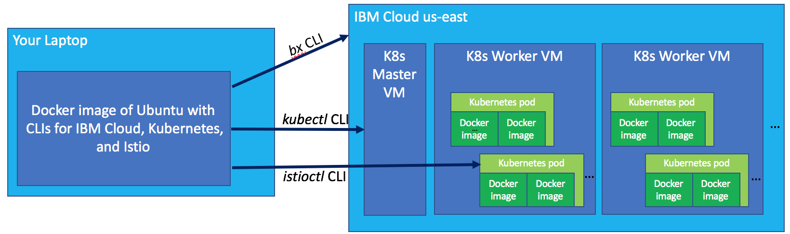

# Exercise 1 - Accessing a Kubernetes cluster with IBM Cloud Container Service

Your IBM Cloud paid account and your Kubernetes cluster have been pre-provisioned for you. Here are the steps to access your cluster:

### Use Docker image containing Kubernetes, Istio, and IBM Cloud CLIs

1. Install Docker if not already installed
- https://docs.docker.com/docker-for-mac/install/
- https://docs.docker.com/docker-for-windows/install/
- https://docs.docker.com/engine/installation/linux/docker-ce/ubuntu/

2. Run the demo image

From a system with Docker installed,

```
git clone git@github.com:esnible/istio-clienv.git
cd istio-clienv
./scripts/build.sh
docker run -it --name devenv -p 8001:8001 middleware17/istioenv
```

The build should take about a minute and a half.

<!-- docker pull snible/middleware17/istioenv # first push my image to the Docker hub -->

This image includes the CLI _bx_, for accessing IBM Cloud, _kubectl_, for accessing Kubernetes,
and _istioctl_ for accessing Istio.  It also includes the Istio 0.2.12 download.

### (Alternate) Building your own command line environment

Follow the instructions at https://github.com/szihai/istio-workshop/blob/master/exercise-1/README.md to
install the tools on yourself.

### Access your cluster

To use the Kubernetes
that has been prepared for this tutorial you must log in to IBM Cloud.  Use the tutorial-provided email address,
not your own.

```
bx login -a https://api.ng.bluemix.net -u <EMAIL> --apikey <KEY>
```

If asked, choose _us-south - https://api.ng.bluemix.net_ as your endpoint.
If you are using your own account, just do "bx login" as your normally would.

```
# If you are using your own cluster (rather than the demo accounts), you can skip setting the region
bx cs region-set us-east
bx cs clusters
bx cs cluster-config guestbook # Use your own cluster name if using your own account
```

Cut-and-paste the configuration output by the previous step, or automatically apply it by doing

```
# Point `KUBECONFIG` to personal Kubernetes cluster on IBM Cloud
eval $(bx cs cluster-config $(bx cs clusters | tail -n 1 | awk '{print $1}') | grep export)
```

At this point _kubectl_ should be functional.  To verify,

```
kubectl get pods
```

### Environment components

For this tutorial we will be communicating with the cloud in three different ways.  We will use three
CLIs to do this.  The _bx_ CLI talks to IBM Cloud, the _kubectl_ CLI talks to Kubernetes, and the _istioctl_
CLI talks to Istio.

Istio runs within Kubernetes, and Kubernetes runs within a cloud.



### Access the Kubernetes web UI


Create a proxy to your Kubernetes API server.

```
# By using 0.0.0.0 instead of the default 127.0.0.1 the UI is available beyond the container
kubectl proxy --address='0.0.0.0' &
```

In a browser, go to http://localhost:8001/ui to access the API server UI.

#### [Continue to Exercise 2 - Deploying a microservice application to Kubernetes](../exercise-2/README.md)
