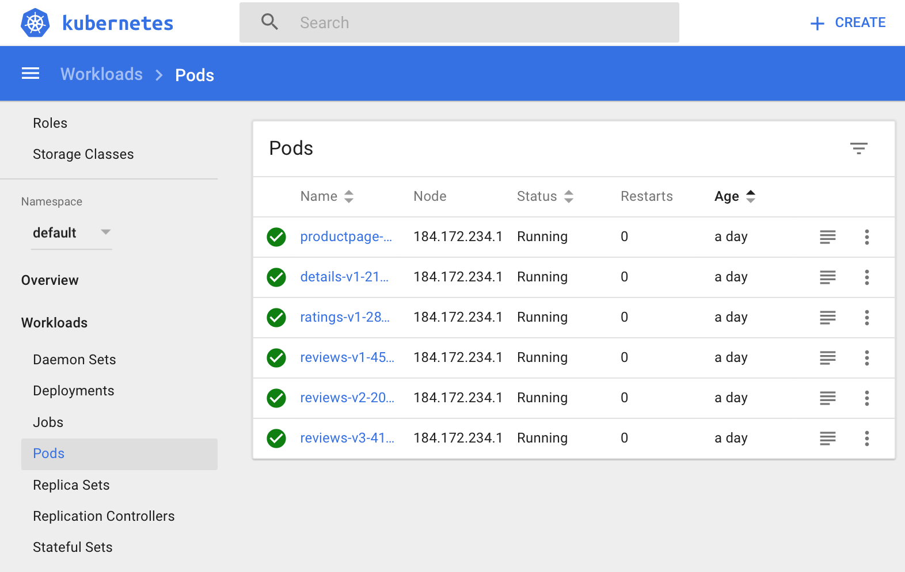
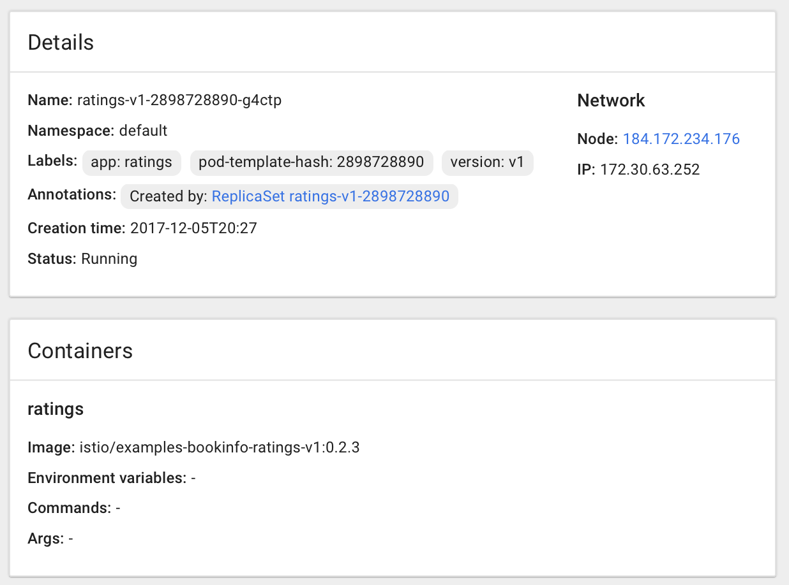
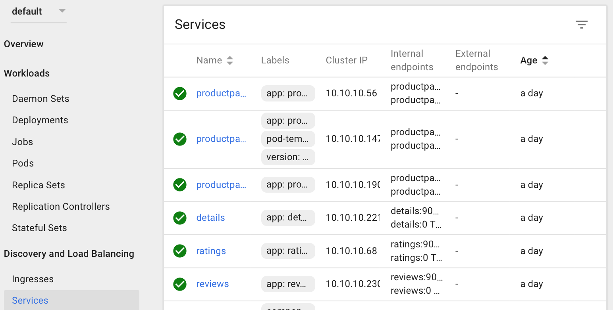
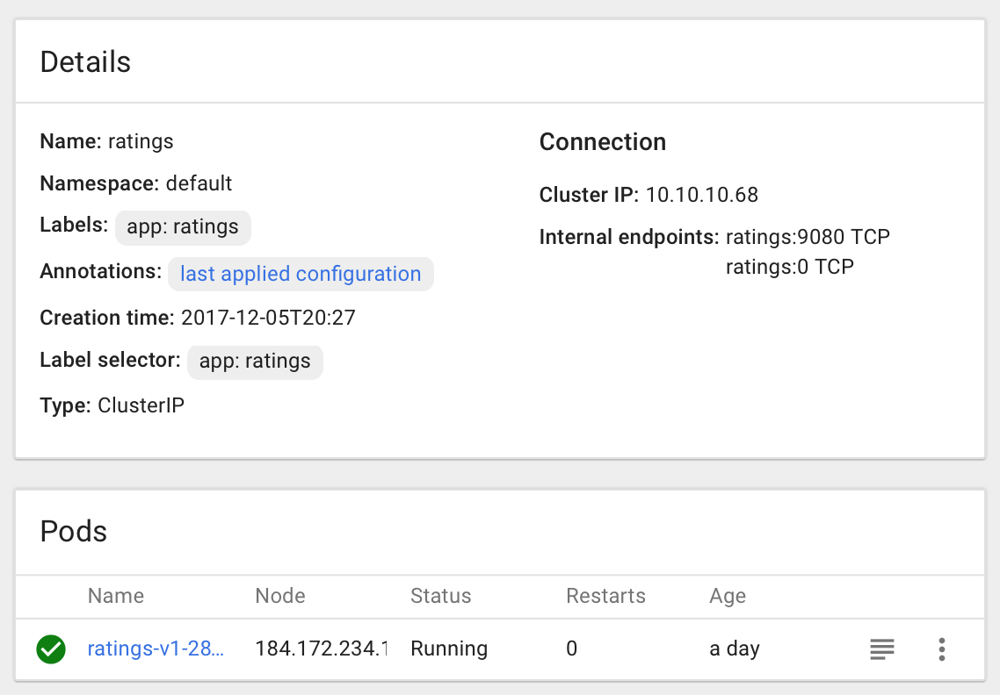

# Exercise 3 - Inspecting a Kubernetes deployment

### Using the Kubernetes dashboard to inspect your system

We performed `kubectl proxy --address='0.0.0.0'` from the Docker instance we launched in [Exercise 1 - Accessing a Kubernetes cluster with IBM Cloud Container Service](../exercise-1/README.md).  As long as the _proxy_ is running we can access the Kubernetes UI at http://localhost:8001/ui

### Inspecting the pods

Select Workloads->Pods to see a list of the pods running in the _default_ namespace.



Clicking on an individual Pod brings up the details of that pod including the containers that run within it.



### Inspecting the services

Although pods have networking a _service_ is used to give them a DNS name so that other pods can find them,
and to optionally expose them to the outside world.  Select Discovery And Load Balancing->Services to see a list of the services
offered for the _default_ namespace.



Clicking on an individual Service brings up the details of that pod including the containers that run within it.



Kubernetes creates a load balancer for all of the pods in the service.  The service details includes a list
of the pods that will receive traffic.

### Accessing Bookinfo

Although we created an Ingress to expose Bookinfo to the outside world it is an Istio Ingress and we aren't
yet ready to show the use of an Ingress.

For now we will use a temporary random IP and port to view the running Bookinfo sample.

```
kubectl expose service productpage --type=NodePort --name productpage-np
# Record the port number between 9080 and TCP, e.g. 9080:32276/TCP would be port 32276
kubectl get services | grep productpage-np
# Record the public IP
bx cs workers middleware17
```

Point your browser to `<public-IP>:<nodeport>/productpage`.  You should see the Bookinfo UI there.  We will be
using this UI for further experiments.

<!--
Any web services on any pod can be exposed locally.  The Docker instance running the tutorial environment has port 8080 exposed.  Let's 

```
# localhost:8080 will respond as if it was productpage-v1:9080
kubectl port-forward productpage-v1-150936620-xv1j3 8080:9080
curl localhost:8080
```

Unfortunately the browser can't see productpage because the port-forward binds to 127.0.0.1, not 0.0.0.0.

-->


#### [Continue to Exercise 4 - Installing Istio](../exercise-4/README.md)