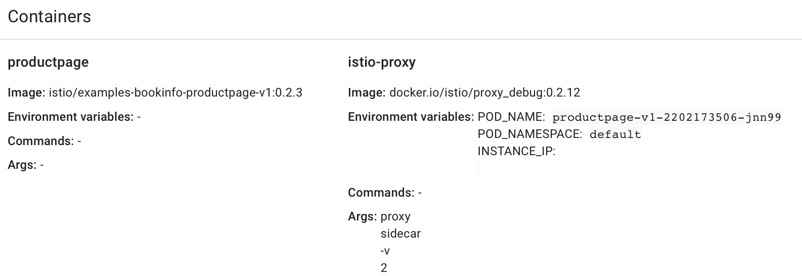
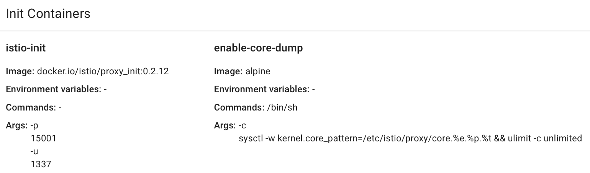

# Exercise 5 - Deploying a microservice application with Istio Proxies

We deployed Bookinfo without Istio before.  Now we will deploy it with Istio.

### The sidecar concept

A Kubernetes pod is a group of containers that share networking and lifecycle.

A _sidecar_ is a small container that typically provides a behavior aspect for the container.  The term
comes from the traditional "sidecar", a one-wheeled device attached to a motorcycle.

A special container type in a pod is _Init Container_.  This is a container that is only active during initialization.

Istio is mostly transparent to your application pods because it uses two mechanisms to inject networking
behavior aspects into your pods.  Under Istio, the application containers in the pod do not directly
communicate on the network.  An Init Container sets up IPTables rules to ensure inter-pod traffic goes through
the Istio Proxy sidecar.

### Injecting sidecars into your application

Istio supports automatically injecting sidecars.  You'll need this if you are using a deployment tool such as
Helm and don't have control of your deployment descriptors.  For purposes of the tutorial we will explain how
to inject manually.

Kubernetes typically uses a _Deployment File_ to specify deployments, pods, and services.  These files
are written in YAML.  Istio's sample bookinfo includes a file.  Let's review it first.

```
cd /tmp/istio-0.2.12
vi samples/bookinfo/kube/bookinfo.yaml
```

"Injecting Istio" into your application pods just means adding the appropriate Init Container and Istio Proxy.
Istio can read your Kubernetes deployment descriptor and create an equivalent descriptor that includes these
components.  To generate and view Istio's proposed modification, run

```
istioctl kube-inject -f samples/bookinfo/kube/bookinfo.yaml | more
```

To actually deploy the manually generated deployment, execute

```
kubectl apply -f <(istioctl kube-inject -f samples/bookinfo/kube/bookinfo.yaml)
```

Of course, if you were using automatic injection, you wouldn't need to explicitly invoke _istioctl_.

Confirm that services and pods are running:

```
kubectl get services
kubectl get pods
```

When we invoke `kubectl describe pod` we can see information about the containers that Istio uses to
implement the service mesh.

```
kubectl describe pod productpage-v1-...
...
Init Containers:
  istio-init:
    Image:         docker.io/istio/proxy_init:0.2.12
...
Containers:
  productpage:
...
    Image:          istio/examples-bookinfo-productpage-v1:0.2.3
...
  istio-proxy:
    Container ID:  docker://035b1d008887270a42f682ff454df941a52913b072a21e09c87411cdbc3bc434
    Image:         docker.io/istio/proxy_debug:0.2.12
    Image ID:      docker-pullable://istio/proxy_debug@sha256:c87f24ae58b98aad9ad8830e38677ce6a2b29bc341cdf8154f0f48139715d405
    Port:          <none>
    Args:
      proxy
      sidecar
      -v
      2
...
```

We can see similar details in the Kubernetes web UI




### Trying out the Bookinfo application with Istio installed but no special behavior.

External load balancer is not available for kubernetes clusters in the IBM Cloud free tier. You can use the public IP of the worker node, along with the NodePort, to access the ingress. The public IP of the worker node can be obtained from the output of the following command:

```
bx cs workers guestbook # or use your own cluster name
export MYCLUSTER=guestbook
bx cs workers $MYCLUSTER
export GATEWAY_IP=$(bx cs workers $MYCLUSTER | grep Ready | head -n 1 | awk '{ print $2 }')
export GATEWAY_URL=$GATEWAY_IP:$(kubectl get svc istio-ingress -n istio-system -o jsonpath='{.spec.ports[0].nodePort}')
echo Now visit $GATEWAY_URL/productpage
```

#### [Continue to Exercise 6 - Telemetry](../exercise-6/README.md)