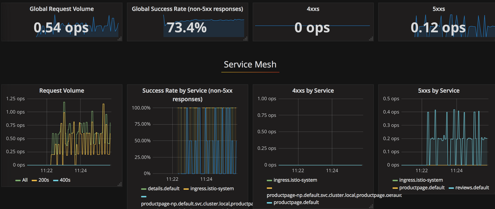
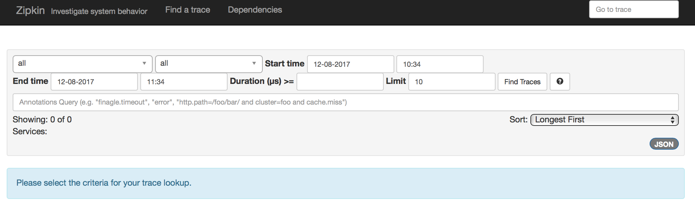
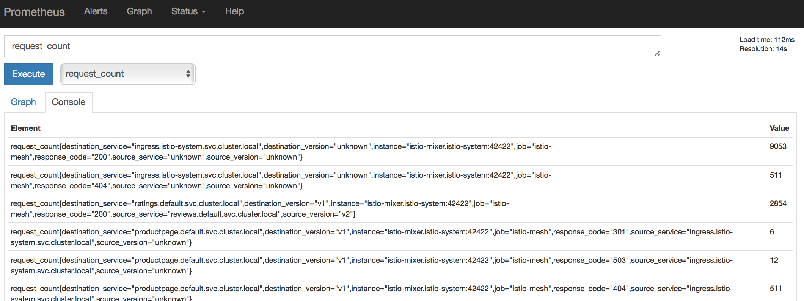

# Exercise 6 - Telemetry

Before we can look at the application's behavior let's generate load.

We exported _GATEWAY_URL_ in [Continue to Exercise 5 - Deploying a microservice application with Istio Proxies](../exercise-5/README.md).

```sh
while sleep 2; do curl -o /dev/null -s -w "%{http_code}\n" http://${GATEWAY_URL}/productpage; done
```

The loop doesn't terminate.  We can open another window into our dev environment container using

```
docker exec -it devenv /bin/bash
```

To re-establish settings to talk to the IBM Cloud Kubernetes cluster,

```
bx cs cluster-config guestbook # Use your own cluster name if using your own account
```

## View guestbook telemetry data

<!--
Establish port forwarding from local port 3000 to the Grafana instance:
```sh
kubectl -n istio-system port-forward $(kubectl -n istio-system get pod -l app=grafana \
  -o jsonpath='{.items[0].metadata.name}') 3000:3000 &
```

Browse to http://localhost:3000 and navigate to the Istio Dashboard.
-->

We must expose Grafana, Zipkin, and Prometheus to the outside world for testing.  This can be done
using `kubectl port-forward` or by creating a NodePort sevice.  We will create a NodePort, exposing
these services to the entire Internet.

```
# Re-expose the Services as NodePorts so they are visible even when using a cluster without static IPs
kubectl expose service --namespace istio-system grafana --type=NodePort --name grafana-np
kubectl expose service --namespace istio-system zipkin --type=NodePort --name zipkin-np
kubectl expose service --namespace istio-system prometheus --type=NodePort --name prometheus-np
```

Record the public IP

```
export MYCLUSTER=guestbook
bx cs workers $MYCLUSTER
export GATEWAY_IP=$(bx cs workers $MYCLUSTER | grep Ready | awk '{ print $2 }')
echo GATEWAY_IP is $GATEWAY_IP
```

### Grafana

We need the dynamic port number that the NodePort created when it exposed Grafana outside the cluster.

```
# Record the port number between 9080 and TCP, e.g. 9080:32276/TCP would be port 32276
kubectl get services --namespace istio-system | grep grafana-np
export GRAFANA_PORT=$(kubectl --namespace istio-system get service grafana-np  -o jsonpath='{.spec.ports[0].nodePort}')
echo Grafana is at $GATEWAY_IP:$GRAFANA_PORT
```

Browse to `http://<gateway>:<port>/dashboard/db/istio-dashboard`

The control panel provides the global request volume and success rate and 4xx/5xx HTTP responses,
along with breakdowns by service of these features.  These features come from Istio.  Applications do
not need to report these metrics.




### Zipkin

Zipkin is a distributed tracing system. Zipkin holds timing data needed to troubleshoot latency problems in microservice architectures.
Istio can reduce or eliminate the need to instrument applications to report timing data to Zipkin.
Zipkin’s design is based on the Google Dapper paper.

The Zipkin UI also presents a Dependency diagram showing how many traced requests went through each application.

<!--
Establish port forwarding from local port 9411 to the Zipkin instance:
```sh
kubectl port-forward -n istio-system \
  $(kubectl get pod -n istio-system -l app=zipkin -o jsonpath='{.items[0].metadata.name}') \
  9411:9411 &
```

Browse to http://localhost:9411.
-->

We need the dynamic port number that the NodePort created when it exposed Zipkin outside the cluster.

```
# Record the port number between 9080 and TCP, e.g. 9080:32276/TCP would be port 32276
kubectl get services --namespace istio-system | grep zipkin-np
export ZIPKIN_PORT=$(kubectl --namespace istio-system get service zipkin-np  -o jsonpath='{.spec.ports[0].nodePort}')
echo Zipkin is at $GATEWAY_IP:$ZIPKIN_PORT
```

Browse to `http://<gateway>:<port>`

Click the "JSON" button to do a query of the data Zipkin has captured.




### Prometheus

<!--
Establish port forwarding from local port 9090 to the Prometheus instance:
```sh
kubectl -n istio-system port-forward \
  $(kubectl -n istio-system get pod -l app=prometheus -o jsonpath='{.items[0].metadata.name}') \
  9090:9090 &
```
-->

We need the dynamic port number that the NodePort created when it exposed Prometheus outside the cluster.

```
# Record the port number between 9080 and TCP, e.g. 9080:32276/TCP would be port 32276
kubectl get services --namespace istio-system | grep prometheus-np
export PROMETHEUS_PORT=$(kubectl --namespace istio-system get service prometheus-np  -o jsonpath='{.spec.ports[0].nodePort}')
echo Prometheus is at $GATEWAY_IP:$PROMETHEUS_PORT
```

#### Using Prometheus

To see Prometheus in action, browse to `http://<gateway>:<port>`, and in the “Expression” input box, enter: `request_count`. Click **Execute**.




#### [Continue to Exercise 7 - Request routing](../exercise-7/README.md)